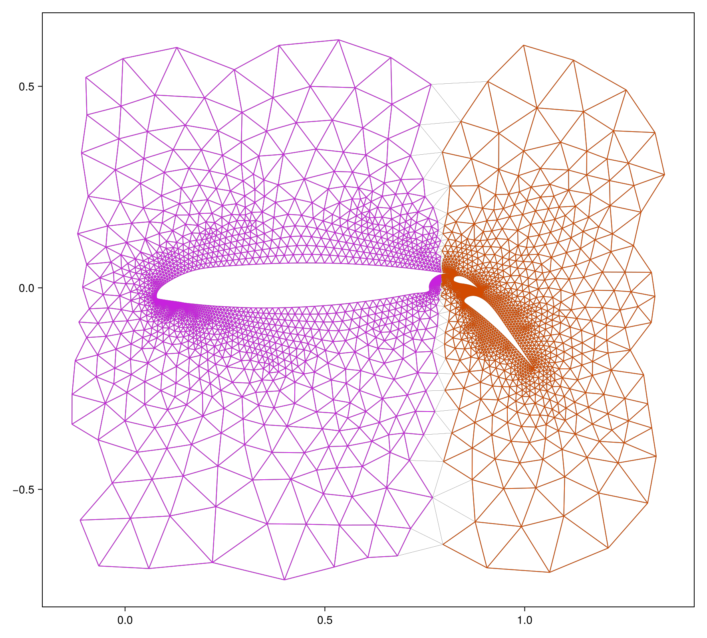
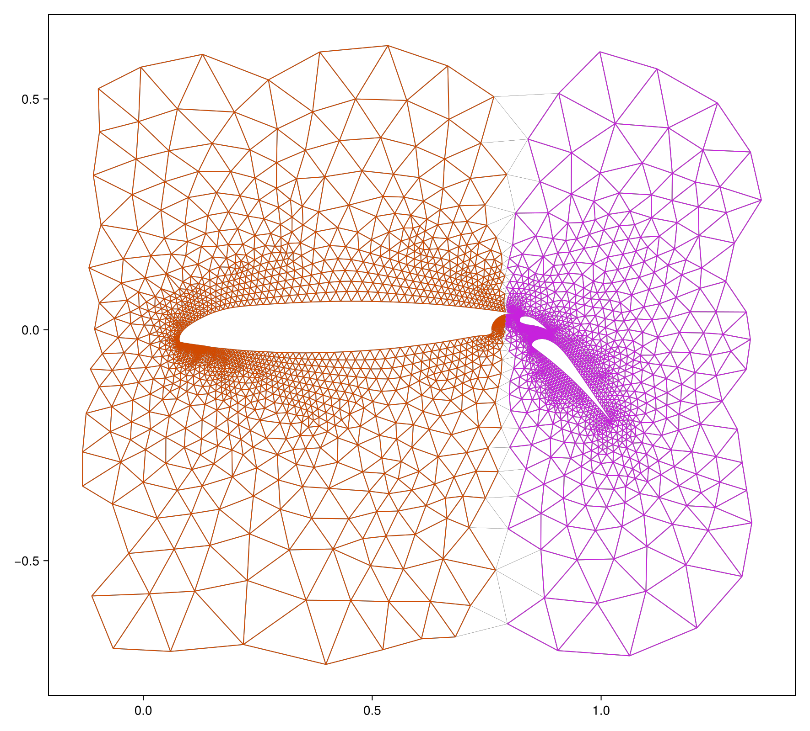
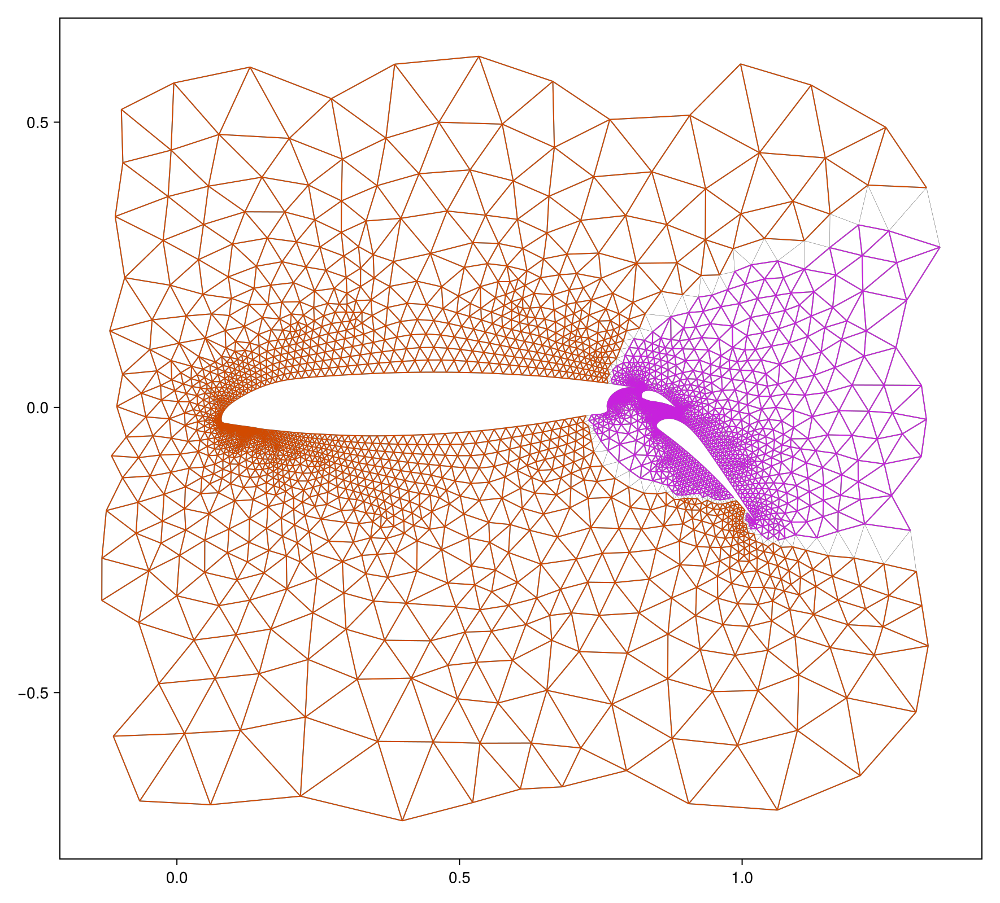
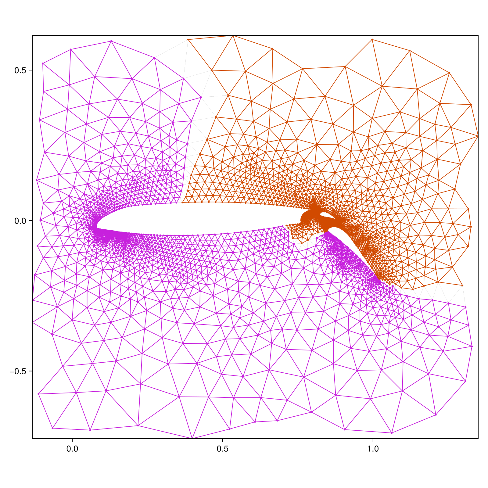
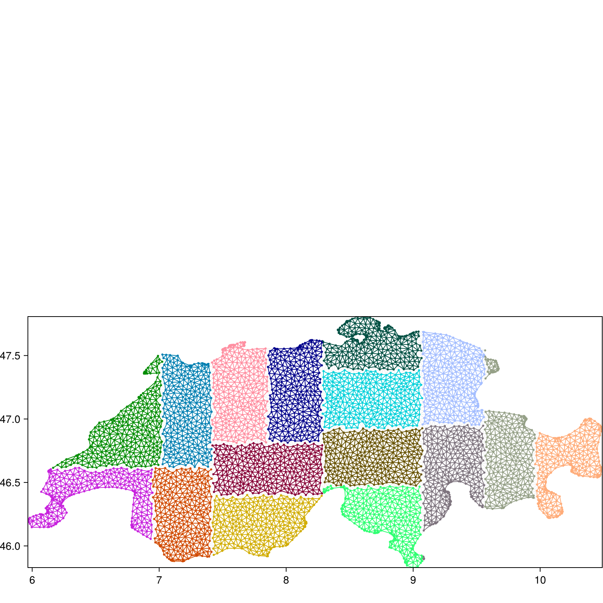
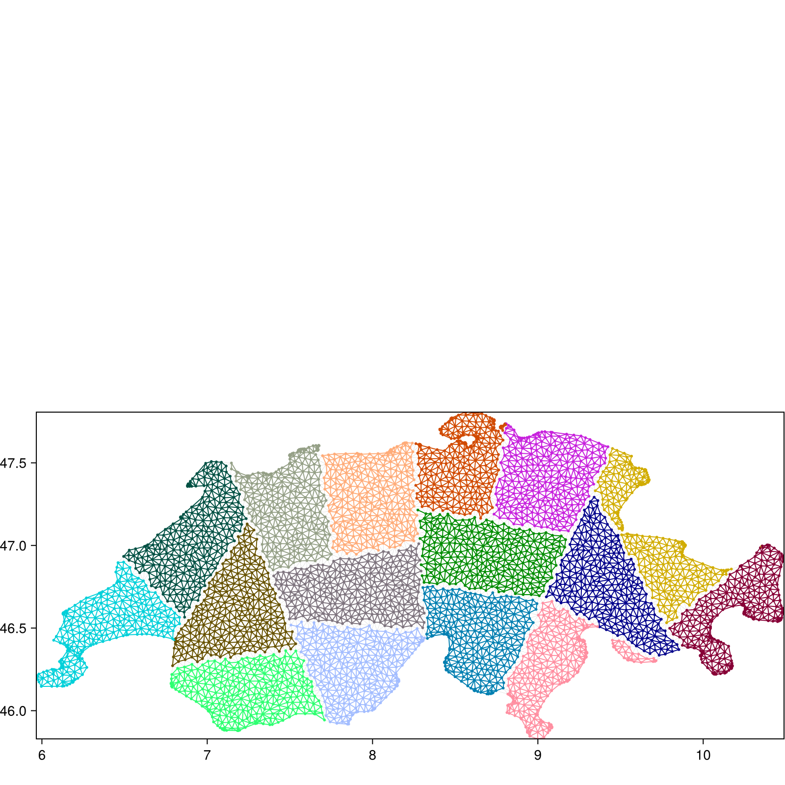
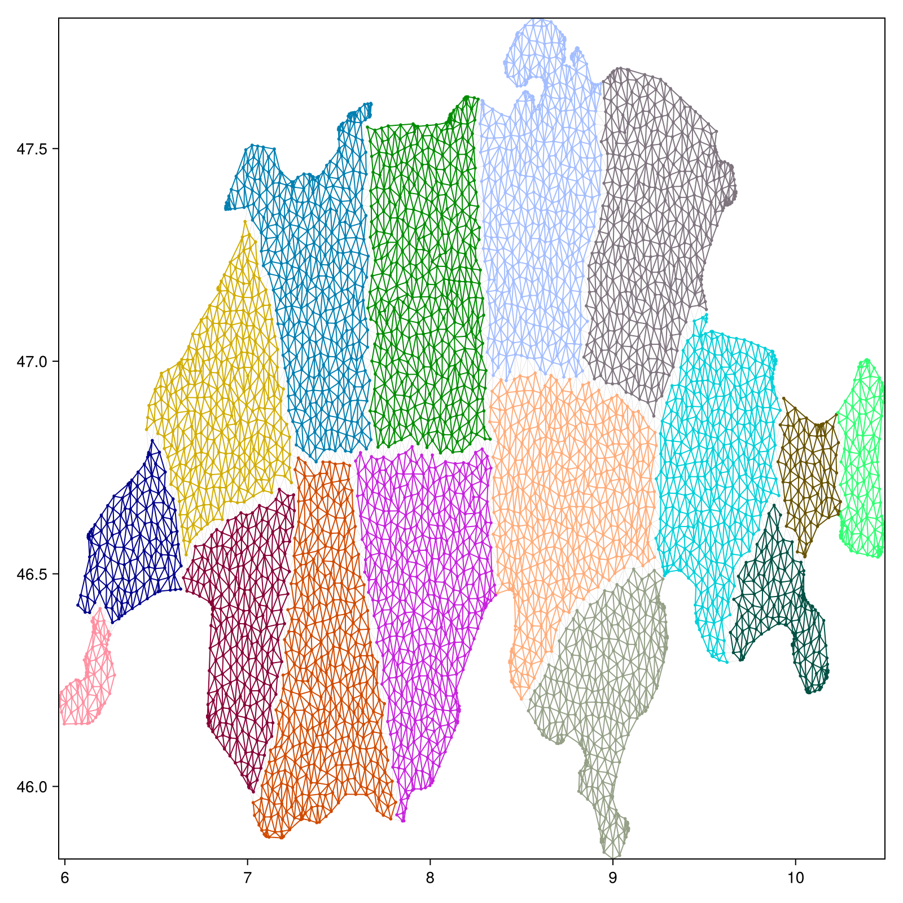
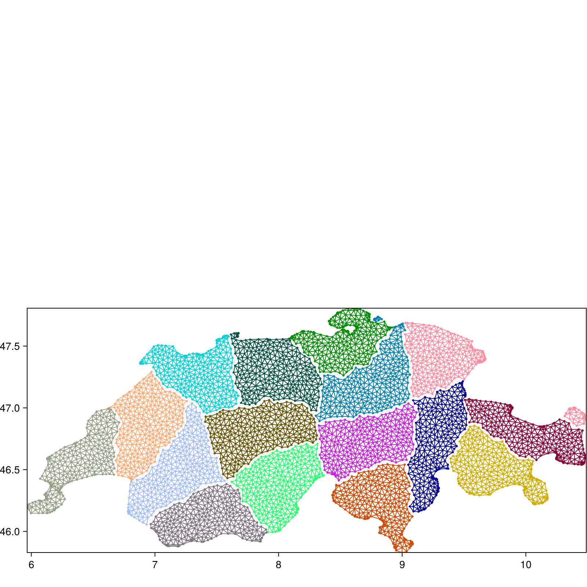

# GraphLab.jl
[](https://github.com/lechekhabm/GraphLab.jl/actions/workflows/ci.yml)
[](https://lechekhabm.github.io/GraphLab.jl/dev)
[](https://github.com/lechekhabm/GraphLab.jl/blob/main/LICENSE)

## Overview

<p align="center">
  
</p>

``GraphLab.jl`` is a Julia package for exploring, experimenting, and learning graph partitioning algorithms.
It provides a growing set of accessible methods, including:
1. [coordinate bisection](https://lechekhabm.github.io/GraphLab.jl/dev/api/#GraphLab.part_coordinate-Tuple%7BSparseArrays.SparseMatrixCSC,%20Matrix%7D)
2. [inertial bisection](https://lechekhabm.github.io/GraphLab.jl/dev/api/#GraphLab.part_inertial-Tuple%7BSparseArrays.SparseMatrixCSC,%20Matrix%7D)
3. [random spheres bisection](https://lechekhabm.github.io/GraphLab.jl/dev/api/#GraphLab.part_randsphere-Tuple%7BSparseArrays.SparseMatrixCSC,%20Matrix%7BFloat64%7D%7D)
4. [spectral bisection](https://lechekhabm.github.io/GraphLab.jl/dev/api/#GraphLab.part_spectral-Tuple%7BSparseArrays.SparseMatrixCSC%7D)
5. [geometric spectral bisection](https://lechekhabm.github.io/GraphLab.jl/dev/api/#GraphLab.part_geospectral-Tuple%7BSparseArrays.SparseMatrixCSC%7D)
6. [simple space-filling curve partitioning](https://lechekhabm.github.io/GraphLab.jl/dev/api/#GraphLab.part_adaptive_sfc)
7. [adaptive space-filling curve partitioning](https://lechekhabm.github.io/GraphLab.jl/dev/api/#GraphLab.part_adaptive_sfc)
8. [METIS partitioning](https://lechekhabm.github.io/GraphLab.jl/dev/api/#GraphLab.part_metis)
9. [recursive partitioning](https://lechekhabm.github.io/GraphLab.jl/dev/api/#GraphLab.recursive_bisection)
10. [nested dissection](https://lechekhabm.github.io/GraphLab.jl/dev/api/#GraphLab.nested_dissection-Tuple%7BSparseArrays.SparseMatrixCSC,%20Function%7D)

The package includes utilities for:
* Generating graphs and adjacency matrices.
* Measuring partition quality.
* Visualizing partitioned graphs.
* Benchmarking and comparing with external partitioners.
``GraphLab.jl`` aims to support the educational and exploratory needs of learners, researchers, and the Julia graph community.

Feel free to contribute or report issues on the GitHub repository for ``GraphLab.jl``. Happy partitioning!

## Getting Started

### Installation
To install the package from GitHub and add it to your working environment, follow these steps:

1. Add the ``GraphLab.jl`` to you project using the Julia command:
   ```julia
   using Pkg
   Pkg.add(url="https://github.com/lechekhabm/GraphLab.jl")
   ```
   **Note:** If you have an SSH key set up with GitHub, you can install the package using SSH:
   ```julia
   Pkg.add(url="https://<YOUR_GITHUB_TOKEN>@github.com/lechekhabm/GraphLab.jl.git")
   ```
   Replace `<YOUR_GITHUB_TOKEN>` with a valid token that has repository read access.

3. Basic Example:
   ```julia
   using GraphLab
   A, coords = GraphLab.grid_graph(10, 50, π/3)
   p = GraphLab.part_spectral(A)
   GraphLab.draw_graph(A, coords, p, file_name="test.png")
   ```
   
  For further details on the package and its functions, see [Documentation](https://lechekhabm.github.io/GraphLab.jl/dev/).

### Prerequisites and Dependencies

The package will automatically install the following dependencies: **Arpack**, **CairoMakie**, **Colors**, **Graphs**, **LinearAlgebra**, **Metis**, **SparseArrays**, **Statistics**, **AMD**, **GraphsMatching**, **JuMP**, and **Cbc**.

For additional usability, you may need the following packages: **DelimitedFiles**, **MAT**, **Plots**, and **PrettyTables**.

Refer to the source code and `Project.toml` files within the `examples/` directory for further details about dependencies and configurations. Additional explanations are provided later in this document.

## Running Examples

The package includes example scripts in the `GraphLab/examples/` directory. These scripts demonstrate how to use the package to benchmark and compare different graph partitioning methods.

To run these examples you need to clone the repo using the command:
   ```bash
   git clone https://github.com/lechekhabm/GraphLab.jl
   ```

### Example 1: Comparing Partitioning Methods

**Script:** `GraphLab.jl/examples/ex1.jl`

This example compares different graph partitioning methods, including:

- **Coordinate Bisection**
- **Inertial Bisection**
- **Spectral Bisection**
- **Bisection using METIS**

The script evaluates these methods on a series of different graphs, providing insights into their performance and effectiveness.

<!-- 2x2 Grid for Airfoil1 Examples -->
<table style="width:100%; border-collapse: collapse;">
  <tr>
    <!-- Coordinate Bisection -->
    <td style="width:50%; text-align: center; padding: 0;">
      
      <p style="margin: 0; padding: 0;"><em>Coordinate Bisection</em></p>
    </td>
    <!-- Inertial Bisection -->
    <td style="width:50%; text-align: center; padding: 0;">
      
      <p style="margin: 0; padding: 0;"><em>Inertial Bisection</em></p>
    </td>
  </tr>
  <tr>
    <!-- Spectral Bisection -->
    <td style="width:50%; text-align: center; padding: 0;">
      
      <p style="margin: 0; padding: 0;"><em>Spectral Bisection</em></p>
    </td>
    <!-- METIS Bisection -->
    <td style="width:50%; text-align: center; padding: 0;">
      
      <p style="margin: 0; padding: 0;"><em>METIS</em></p>
    </td>
  </tr>
</table>

#### How to Run Example 1

1. Navigate to the `examples` directory:

   ```bash
   cd GraphLab.jl/examples
   ```

2. Run the example script in the Julia or directly from the terminal:

   ```bash
   julia --project="." ex1.jl
   ```

### Example 2: Recursive Bisection

**Script:** `GraphLab.jl/examples/ex2.jl`

This example demonstrates recursive bisection using different methods, including:

- **Coordinate Bisection**
- **Inertial Bisection**
- **Spectral Bisection**
- **Recursive Bisection using METIS K-way**

<table style="width:100%; border-collapse: collapse;">
  <tr>
    <!-- Recursive Coordinate Bisection -->
    <td style="width:50%; text-align: center; padding: 10px;">
      
      <p style="font-size: 12px;"><em>Recursive Coordinate Bisection</em></p>
    </td>
    <!-- Recursive Inertial Bisection -->
    <td style="width:50%; text-align: center; padding: 10px;">
      
      <p style="font-size: 12px;"><em>Recursive Inertial Bisection</em></p>
    </td>
  </tr>
  <tr>
    <!-- Recursive Spectral Bisection -->
    <td style="width:50%; text-align: center; padding: 10px;">
      
      <p style="font-size: 12px;"><em>Recursive Spectral Bisection</em></p>
    </td>
    <!-- Recursive METIS Bisection -->
    <td style="width:50%; text-align: center; padding: 10px;">
      
      <p style="font-size: 12px;"><em>Recursive METIS Bisection (K-way is also available)</em></p>
    </td>
  </tr>
</table>

#### How to Run Example 2

1. Navigate to the `examples` directory:

   ```bash
   cd GraphLab.jl/examples
   ```

2. Run the example script in the Julia or directly from the terminal:

   ```bash
   julia --project="." ex2.jl
   ```
If the examples fails to run, try set up the environment in `examples`:
```julia
using Pkg
Pkg.develop(path="..")
Pkg.instantiate()
Pkg.resolve()
```

## Citation

If you use **GraphLab.jl** in your research or teaching, please consider citing our work:
```
@article{GraphLab2025,
author = {Malik Lechekhab and collaborators},
title = {GraphLab.jl: A Julia Framework for Exploring Graph Partitioning},
journal = {In preparation},
year = {2025},
note = {Preprint will be made available at arXiv},
}
```
We will update the citation once the paper is published.

## Authors
* [Malik Lechekhab](https://www.linkedin.com/in/mlechekhab/) (Institute of Computing, Università della Svizzera italiana)
* [Dimosthenis Pasadakis](https://search.usi.ch/en/people/bfe7763cea5221d043f905ad414e1a8d/pasadakis-dimosthenis) (Institute of Computing, Università della Svizzera italiana)
* [Aryan Eftekhari](https://scholar.google.com/citations?user=GiugKBsAAAAJ&hl=en) (Institute of Computing, Università della Svizzera italiana)
* [Roger Käppeli](https://math.ethz.ch/research/applied-mathematics-numerical-analysis-scientific-computing/roger-kaeppeli.html) (Department of Mathematics, ETH Zürich)
* [Olaf Schenk](https://search.usi.ch/en/people/9a52a2fdb8d3d26ec16fb1569b590909/schenk-olaf) (Institute of Computing, Università della Svizzera italiana)

## Acknowledgments  
- Baert, J., *Libmorton: C++ Morton Encoding/Decoding Library*, 2018. [Online]. Available: [https://github.com/Forceflow/libmorton](https://github.com/Forceflow/libmorton). [Accessed: May 30, 2025].
- Sasidharan, A., Gilbert, J. R., Teng, S.-H., and Li, Y., “A General Space-filling Curve Algorithm for Partitioning 2D Meshes,” in Proc. 2015 IEEE 17th Int. Conf. on High Performance Computing and Communications (HPCC), Aug. 2015, pp. 1138–1145, doi: 10.1109/HPCC-CSS-ICESS.2015.192.
- Byrne, S., *GilbertCurves.jl*. [Online]. Available: [https://github.com/CliMA/GilbertCurves.jl](https://github.com/CliMA/GilbertCurves.jl). [Accessed: May 30, 2025].
- Červený, J., *gilbert*. [Online]. Available: [https://github.com/jakubcerveny/gilbert](https://github.com/jakubcerveny/gilbert). [Accessed: May 30, 2025].
- Li, Y., *meshpart Toolbox*. [Online]. Available: [https://github.com/YingzhouLi/meshpart](https://github.com/YingzhouLi/meshpart). [Accessed: May 30, 2025].
- Pitsianis, N., Iliopoulos, A.-S., Floros, D., and Sun, X., “Spaceland Embedding of Sparse Stochastic Graphs,” in Proc. IEEE High Performance Extreme Computing Conf. (HPEC), Sep. 2019, doi: 10.1109/HPEC.2019.8916505.